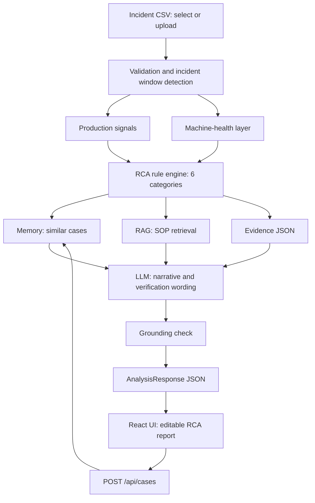

# Production Intelligence & RCA

**Evidence-driven Root Cause Analysis with Machine-Health Insights**
TCS-SASTRA Academy Connect Hackathon, Use Case #11 (Manufacturing: Production RCA Analyzer). Solo build, about 3 hours, 5 phases.

> **Pitch:** The platform combines production signals, machine-health indicators, historical incident experience and SOP knowledge to generate evidence-backed RCA hypotheses and verification actions, without ever claiming an unverified root cause.

> **Principle:** The AI doesn't tell the engineer what happened. It shows what the evidence suggests, what is still unknown, and what to verify.

---

## 1. Problem and scope

When a line misses its output or quality target, the evidence is scattered across sensor readings, events, alarms, downtime, defects, batch data and operator notes. The engineer needs to know three things: *what could have contributed, what supports each possibility, and what should be verified?*

**In scope:**
- Select or upload an incident CSV.
- Build a timeline and analyse the signals.
- Group evidence into six RCA categories.
- Produce up to 3 hypotheses with evidence, confidence and missing checks.
- Retrieve SOP-backed verification steps.
- Recall similar past cases.
- Produce an editable RCA draft and save it as a case.
- Evaluate the whole pipeline against answer keys.

**Out of scope (deliberately):** MQTT or live data, a trained PdM model, live RUL inference, extra sensors, authentication, databases, vector stores, Docker.

## 2. TCS requirement coverage

| TCS expected outcome | How we meet it | API field |
| --- | --- | --- |
| 1. Import and validate events and notes | CSV loader with schema, timestamp and numeric checks (range checks in Phase 2) | `/upload`, 4xx errors |
| 2. Timeline and key indicators | Auto-detected incident window, timeline chart, KPIs | `incident_window`, `kpis`, `/signals` |
| 3. Group evidence by category | Rule engine over machine, material, method, measurement, people, environment | `category_evidence` |
| 4. Up to 3 hypotheses with evidence, uncertainty, missing checks | Ranked cards with high/medium/low confidence | `hypotheses` |
| 5. Editable RCA draft with validation notice | Editable report plus a fixed validation banner | `rca_draft`, `warning` |
| Bonus: cause-and-effect view | Signal → Hypothesis → Verification graph (only if time remains) | derived from `hypotheses` |

## 3. Architecture



**Stack**
- **Backend:** Python, FastAPI, pandas, Pydantic. Run with `uvicorn backend.main:app --reload`.
- **Frontend:** React, Vite, TypeScript, Recharts. Dev server on `http://localhost:5173`.
- **LLM:** Groq.
- **Retrieval:** `rank_bm25`.
- **Memory:** local JSON.

**Division of labour**

| Layer | Responsibility |
| --- | --- |
| `engine/` (pandas) | Validation, baselines, window, deltas, batch concentration, co-movement, precedence, health score, scoring, grounding |
| BM25 RAG | SOP retrieval with source references |
| Memory | Similar historical incidents (signal-signature overlap) |
| LLM (Groq) | Explains the supplied evidence and drafts narrative and verification wording. It never computes or invents numbers. |
| `backend/` (FastAPI) | Thin routes. Calls `engine/` and returns Pydantic models. |
| `frontend/` (React) | Displays the API data only. No analysis logic. |

## 4. Data

**Columns:** the ten TCS columns (`timestamp, line, machine, event_code, temperature, speed, defect_count, downtime_min, batch, operator_note`) plus `vibration` and `motor_current`. These are defined once, in `backend/core/config.py`.

**Pack format:** 1 line × 3 machines × 40 steps (2 min each) = 120 rows per incident. Three machines are needed so that environment and material causes (which affect all machines) can be detected.

**Incident ID rule:** `incident_001.csv` → `INC-001`. Historical cases use `INC-H01` and so on.

**18 incidents, generated by a seeded script** (`generate_data.py`, done):

| Scenario | IDs | Planted pattern |
| --- | --- | --- |
| Cooling (machine) | 001, 009, 017\* | Temp up about 17°C, speed down, vibration flat |
| Mechanical (machine) | 002, 010, 018\* | Vibration up 55-70%, current up, speed jitter, "grinding" note |
| Material | 003, 011\* | Defects concentrated in one batch across machines, sensors normal |
| Method | 004, 012 | Changeover (CHG) precedes the defect rise, one machine |
| People | 005, 013 | Shift change (SHIFT_CHG) precedes the rise, calibration or checklist note |
| Measurement | 006, 014 | Temp flat-lines or spikes, all else normal, defects at baseline |
| Environment | 007, 015 | Temp drifts on all machines together |
| Insufficient evidence | 008, 016 | Weak or conflicting signals |

\*Ambiguous cases: 011 overlaps with method, 017 with mechanical, 018 with cooling. The answer key lists `also_plausible` for these.

`answer_key.json` is read **only** by the eval script. A separate seed of about 12 historical cases (different random seed) feeds memory through `memory_seed.json`.

## 5. API contract (locked in Phase 1)

| Method | Path | Purpose | Phase |
| --- | --- | --- | --- |
| GET | `/`, `/health` | Status | 1 |
| GET | `/api/incidents` | List incidents | 1 |
| POST | `/api/incidents/upload` | Upload and validate a CSV (returns an id) | 1 |
| GET | `/api/incidents/{id}` | Descriptive summary | 1 |
| GET | `/api/incidents/{id}/signals` | Raw rows for charts | 1 |
| POST | `/api/incidents/{id}/analyze` | `AnalysisResponse` (mock in Phase 1, real from Phase 2) | 1 → 3 |
| POST | `/api/cases` | Save an edited RCA as a case (feeds memory) | stub 1, real 3 |
| GET | `/api/evals` | Run evals and return per-metric and per-case results | stub 1, real 5 |

**`AnalysisResponse`**

```text
incident_id: str
analysis_status: "complete" | "insufficient_evidence"
incident_window: {start, end, detected_by: [str]} | null
kpis: {defect_rate, total_defects, downtime_min, alarm_count, event_count, threshold_breaches}
machine_health: [{machine, score 0-100, status: "normal"|"watch"|"degraded"}]
category_evidence: [{category, supporting: [Evidence], contradicting: [Evidence]}]  # all 6, always
hypotheses: [Hypothesis]            # 0-3, empty when insufficient_evidence
similar_cases: [SimilarCase]
rca_draft: str
grounding: {passed: bool, flagged: [str]}
validation_required: true
warning: "These are hypotheses, not confirmed root causes. Engineering validation is required before corrective action."
```

**Field types**
- **`Hypothesis`:** `rank`, `category`, `subcause` (`cooling`, `mechanical` or null), `confidence` (`high`/`medium`/`low`), `score` (**internal only, never shown in the UI**), `supporting_evidence`, `contradicting_evidence`, `missing_checks`, `verification_steps`, `narrative`.
- **`Evidence`:** `signal`, `description`, `value`, `machine`.
- **`VerificationStep`:** `step`, `source` (SOP id), `source_title`.
- **`SimilarCase`:** `case_id`, `confirmed_category`, `confirmed_subcause`, `shared_signals`, `similarity_description`.

`category` is one of: `machine | material | method | measurement | people | environment`. All of these are Pydantic `Literal`s.

## 6. Signal layer (`engine/signals.py`)

1. **Window detection:** the engine finds the incident window from defect, downtime and deviation changes, without being told.
2. **Baseline vs window:** deltas for temperature, speed, vibration and motor current, per machine.
3. **Production KPIs:** defect rate, downtime minutes, alarm and event counts, threshold breaches.
4. **Batch concentration:** defect rate per batch.
5. **Co-movement:** how many machines deviate together.
6. **Event precedence:** whether CHG or SHIFT_CHG occurs shortly before the defect rise.
7. **Machine-health score (0-100):** weighted deviation from baseline plus trend slope. Used as contextual evidence only.
8. **Output:** one evidence dict, which `scoring.py` consumes.

## 7. RCA scoring (`engine/scoring.py`, transparent rule table)

| Hypothesis | Supporting signals | Contradicting signals |
| --- | --- | --- |
| Machine / mechanical | Vibration up, current up, speed jitter, defects up, noise note | Vibration flat, all machines move together |
| Machine / cooling | Target temp up, speed down, ALM_TEMP_HI, defects up, heat/fan note | Temp rises on all machines, flat-lined reading |
| Material | Defects concentrated in one batch across machines, sensors normal, lot note | Defects spread across batches |
| Method | CHG precedes rise, one machine, speed setpoint shift, sensors normal | No CHG event |
| People | SHIFT_CHG precedes rise, sensors normal, operator/handover/calibration note | No SHIFT_CHG event |
| Measurement | Flat-line or non-physical temp jump with no vibration/current/speed change, defects at baseline, panel-vs-housing note | Other signals corroborate |
| Environment | Temp up on 2+ machines together, mild defect rise on all, ambient/AC note | Only one machine deviates |

- Each match adds a weight, and each contradiction subtracts one.
- The normalised score maps to **high / medium / low**.
- If no hypothesis clears the minimum, `analysis_status = "insufficient_evidence"` and the UI shows **"Insufficient evidence - additional verification required."**
- Thresholds are set once, up front, and are not tuned per test case.
- No percentages are shown.

## 8. RAG: SOP knowledge base (`engine/rag.py`)

There are about 8 short fictional SOPs in `data/sops/`. Retrieval uses BM25, and each verification action shows its source id and title.

| SOP | Topic | Serves |
| --- | --- | --- |
| SOP-002 | Downtime and alarm triage | general |
| SOP-004 | Abnormal vibration investigation | mechanical |
| SOP-007 | Cooling system troubleshooting | cooling |
| SOP-012 | Defect analysis and batch check | material |
| SOP-015 | Sensor verification | measurement |
| SOP-018 | Changeover verification | method |
| SOP-021 | Shift handover and calibration check | people |
| SOP-024 | Ambient condition check | environment |

## 9. Experience memory (`engine/memory.py`)

`recall(signals)` and `retain(case)` sit behind a small interface. The backend is local JSON (`memory_seed.json` plus saved cases), matched by signal-signature overlap, for example "shares 3 of 4 signals with INC-H03". The rules are:

- Similar cases are supporting evidence, never proof.
- Store the structured signature and the confirmed cause, not an LLM paraphrase.
- Use leave-one-out in evals, so a test case never retrieves itself.
- The UI label is "Experience Memory."

## 10. LLM contract (`engine/llm.py`)

- **Input:** the evidence dict, retrieved SOP chunks and similar cases.
- **Output (JSON):** for each hypothesis, `narrative`, `verification_steps` (each with an SOP source) and `missing_checks`, plus the `rca_draft`.
- **Prompt rules:**
  - Use only the supplied numbers.
  - Say "co-occurs with," not "caused by."
  - Never state a confirmed root cause.
  - Suggest no actions beyond what the SOPs say.
- The output passes through `engine/grounding.py` (a regex check that every number exists in the evidence) before it is returned.
- **Fallback:** if Groq fails, return template-based narratives so the demo still works.

## 11. UI (React + Vite + TS, `frontend/`)

- **Page 1, RCA Analysis:**
  1. Incident picker or upload.
  2. Incident summary and KPIs.
  3. Machine-health cards.
  4. Timeline charts (Recharts) with the window shaded.
  5. Six-category evidence grid.
  6. Top-3 hypothesis cards (evidence, confidence badge, missing checks, SOP source).
  7. Similar cases.
  8. Editable RCA draft (a textarea).
  9. Validation banner.
  10. **Save as Case** button.
- **Page 2, Evals:** a run button, the per-metric table and the per-case pass/fail table.
- The insufficient-evidence state is rendered explicitly, not as an empty list.
- The banner is always visible:

> ⚠️ **These are hypotheses, not confirmed root causes. Engineering validation is required before corrective action.**

**UI fallback if time runs short:** a single page with a picker, the hypothesis cards, the draft and the banner. The charts and the Evals page are cut first.

## 12. Evaluation (`evals/run_evals.py`)

| Metric | Definition |
| --- | --- |
| Top-3 category accuracy | The expected category appears in the top-3 hypotheses |
| Sub-cause accuracy | Cooling vs mechanical is correct (top-1 and top-3) |
| Evidence grounding | Numbers and signals in the output exist in the evidence (regex check, no LLM judge) |
| SOP retrieval hit rate | The expected SOP is in the retrieved results |
| Memory retrieval | A same-category historical case is recalled (leave-one-out) |
| Abstention | Insufficient cases abstain correctly, and clear cases are not wrongly abstained |

- Results are reported **per metric**, never averaged into one score, alongside a per-case pass/fail table.
- Honest framing: the system was tested on 18 planted synthetic incidents, including 3 ambiguous and 2 no-evidence cases.

## 13. Build phases (about 3 hrs)

| Phase | Time | Block | Status |
| --- | --- | --- | --- |
| 0 | done | Data generator, answer keys, memory seed | ✅ |
| 1 | 0:00-0:30 | FastAPI foundation, schemas, loader, upload, mock analysis, stubs | next |
| 2 | 0:30-1:15 | `signals.py`, `scoring.py`, health score; real analysis replaces the mock. **Checkpoint: real hypotheses from the API** | |
| 3 | 1:15-1:50 | SOPs and BM25, Groq prompt and fallback, grounding, memory and `/api/cases`. **Checkpoint: full `AnalysisResponse`** | |
| 4 | 1:50-2:35 | React frontend (Page 1, then Page 2) | |
| 5 | 2:35-3:00 | Evals and `/api/evals`, README/manual, prompts log, screenshots, demo rehearsal | |

**Cut order if behind:**
1. Bonus graph
2. Evals page UI (keep the eval script and print its table)
3. Charts
4. Memory
5. Machine-health cards
6. Co-movement

**Never cut:** core RCA, abstention, grounding, verification actions, eval numbers, validation banner.

**Session continuity:** every phase starts by reading `plan.md` and `progress.md`, and ends by updating `progress.md`.

## 14. Deliverables

- [ ] Working prototype (FastAPI + React)
- [ ] Source code
- [ ] Architecture diagram (section 3)
- [ ] Sample outputs (2-3 incident screenshots)
- [ ] Presentation and demo
- [ ] User manual (1 page, `docs/manual.md`)
- [ ] Prompts log (`docs/prompts_log.md`, kept as you build)

**Project layout**

```text
generate_data.py ✅
data/{incidents/, answer_key.json, memory_seed.json, sops/}
backend/{main.py, api/routes/, core/config.py, models/schemas.py, services/}
engine/{signals, scoring, rag, memory, llm, grounding}.py
frontend/            (Vite React TS)
evals/run_evals.py
docs/{manual.md, prompts_log.md}
plan.md
progress.md
```

## 15. Evaluation-criteria mapping

| Criterion | Our evidence |
| --- | --- |
| Technical implementation | Deterministic engine, RAG, memory and LLM behind a typed API, with a separate React client |
| Innovation | Evidence fusion, abstention, machine-health as context, experience memory |
| Completeness | All 5 TCS outcomes, plus the optional bonus graph |
| Accuracy of verification | Eval table with answer keys and the grounding check |
| AI usage in SDLC | AI-assisted data generation, phased agent prompts, prompts log |
| Prompts used | Prompts log in `docs/` |
| Team work | Solo build, stated clearly |
| Presentation | 5-minute scripted demo |
| Value-added features | Machine-health layer, experience memory, abstention, SOP grounding, Swagger docs |

## 16. Demo (5 min)

1. Pick a cooling incident. The window is detected, and the timeline, KPIs and health cards appear.
2. Show the six-category evidence grid, then the three hypotheses. Open the top one: evidence → missing checks → verification.
3. Open the SOP source for one verification step.
4. Show similar past cases from Experience Memory.
5. Edit the draft and click **Save as Case**.
6. Load incident 008 and show the "Insufficient evidence" result.
7. Finish on the eval table, quoting only the real numbers.

## 17. What we will and won't claim

| ✅ We say | ❌ We never say |
| --- | --- |
| "AI generates ranked RCA hypotheses supported by available evidence" | "AI finds the root cause" |
| "Machine-health indicators provide additional evidence" | "Our model predicts machine failure" |
| "The prototype analyses uploaded incident data" | "Real-time monitoring" |
| "RUL, where shown, is contextual evidence only" | "The machine failed because RUL reached X" |

## 18. Risks

- **Time overrun (now with a separate frontend):** follow the cut order and hit both checkpoints. The React UI fallback is a single page.
- **LLM invents numbers:** the grounding checker, the strict JSON contract and a template fallback.
- **Contract drift between backend and frontend:** the schema is locked in Phase 1, and the frontend types mirror `schemas.py`.
- **Eval circularity:** the data is synthetic and planted, so say so upfront, and include the ambiguous and no-evidence cases.
- **Venue Wi-Fi:** local JSON memory, plus a cached or template LLM output as a fallback.
- **CORS issues:** allow `http://localhost:5173` from Phase 1.
